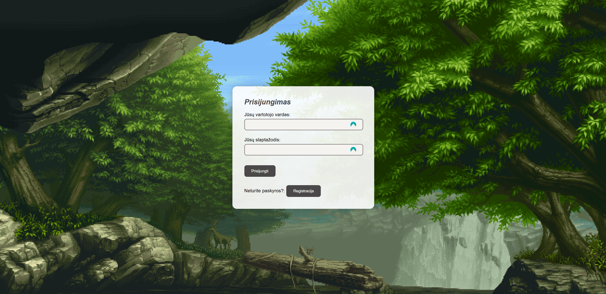
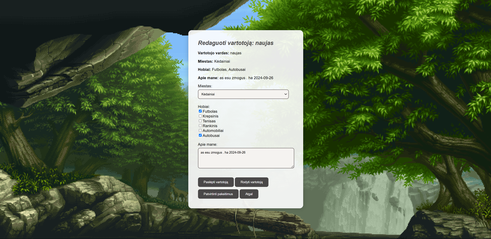
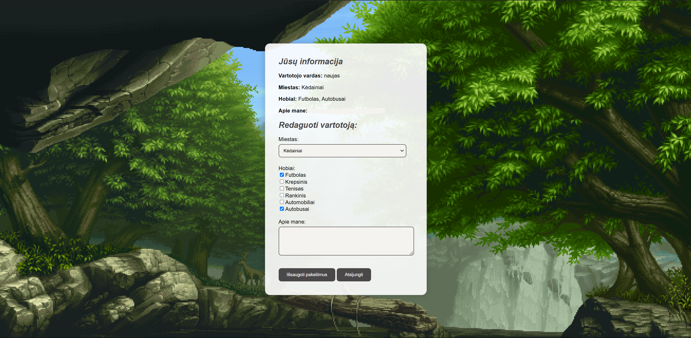

# PHP Login and Registration System

This project is a fully functional login and registration system built using PHP and MySQL. It features user authentication, admin controls, and additional functionality for managing hidden users, hobbies, and cities. This project serves as part of my portfolio, showcasing my skills in PHP and database management.

## Features

### User Authentication
- Login and registration system with password hashing using PHP's `password_hash` and `password_verify`.

### Admin Functionality
- Admins can manage users, view hidden users, and update their information.

### User Management
- Users can update their personal information, including city, hobbies, and "About Me" sections.
- Hidden users can be restored by the admin.

### City and Hobby Dropdowns
- Preloaded cities and hobbies to select from.

### Security
- SQL queries are parameterized to prevent SQL injection.
- Session management for user authentication.

## File Structure

```
📂 formosofficial
├── 📄 edit_user.php       # Admin interface to edit user details
├── 📄 formosdb.php        # Database connection file
├── 📄 formosdb.sql        # SQL dump file for database setup
├── 📄 index.php           # Login page
├── 📄 yourinfo.php        # Displays and updates user information
├── 📄 login.php           # Login logic
├── 📄 logout.php          # Handles user logout
├── 📄 readme.md           # Documentation file (this file)
├── 📄 register.php        # Registration page
├── 📄 styles.css          # CSS styles for the site
├── 📄 update_info.php     # Handles user info updates
└── 📄 UserRegistration.php # Registration logic class
```

## Setup Guide

### 1. Prerequisites
- XAMPP (or any local server with PHP and MySQL support).
- PHP version >= 7.4 (recommended 8.x).
- A MySQL database.

### 2. Installation

#### Clone the repository or download the project files:
```bash
git clone https://github.com/your-username/formosofficial.git
cd formosofficial
```

#### Set up your database:
- Import the provided SQL dump file `formosdb.sql` using phpMyAdmin or MySQL CLI.

#### Configure database connection:
- Open `formosdb.php` and update the following with your local server details:
```php
private $servername = "localhost"; // Your server host
private $username = "root";       // Your database username
private $password = "";           // Your database password
private $dbname = "formosdb";     // Database name
```

#### Start your server:
- Run XAMPP and start Apache and MySQL.

#### Access the application:
- Navigate to `http://localhost/formosofficial/index.php` in your browser.

## Usage

### Login
- Use the admin login credentials from the database:
  - **Username**: admin
  - **Password**: (as hashed in the database).

### Registration
- Register as a new user to create a personal account.
- Update your information in the "Your Info" section.

### Admin Functionality
- Admins can view and edit all user information, manage hidden users, and restore accounts.

## Restrictions
This project is for portfolio purposes only.  
You are free to view and use this project as a reference, but **modification or redistribution** of this code without permission is strictly prohibited.

## Screenshots

### Login Page


### Admin Dashboard


### Editing User Information


### Viewing User Information



## Technologies Used
- **Frontend**: HTML, CSS.
- **Backend**: PHP.
- **Database**: MySQL.

